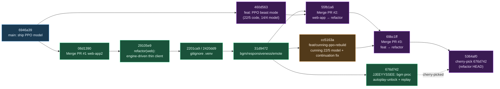
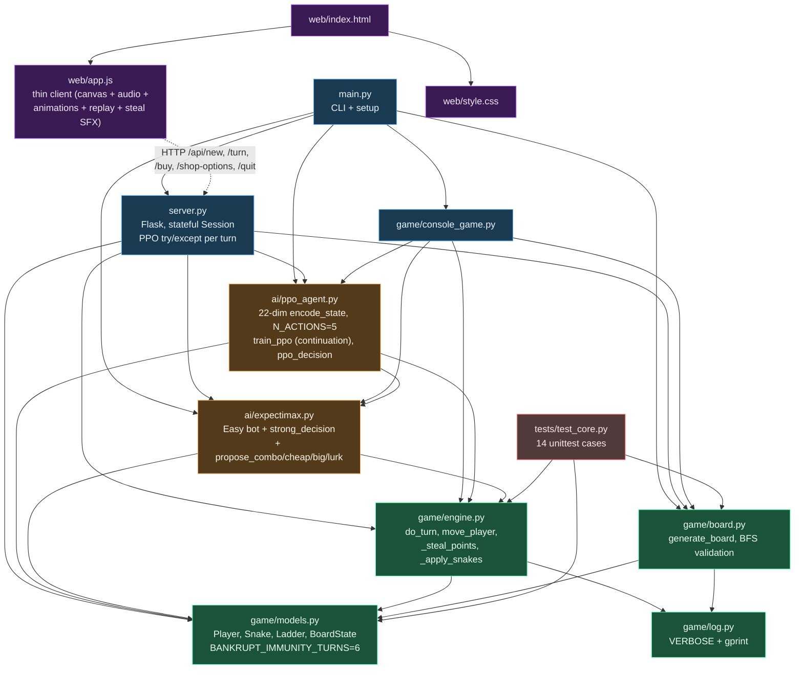
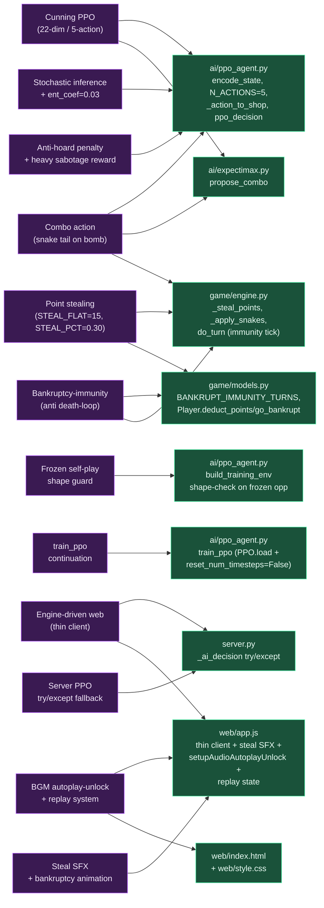
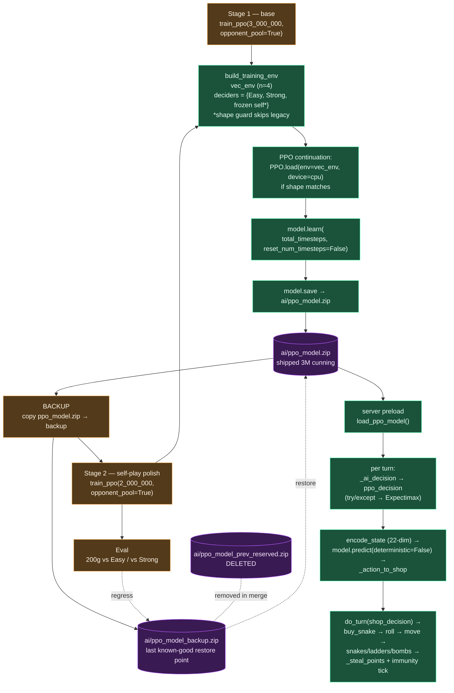
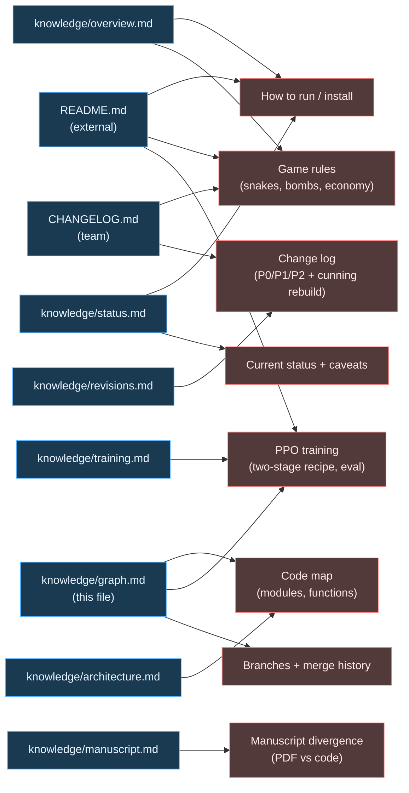
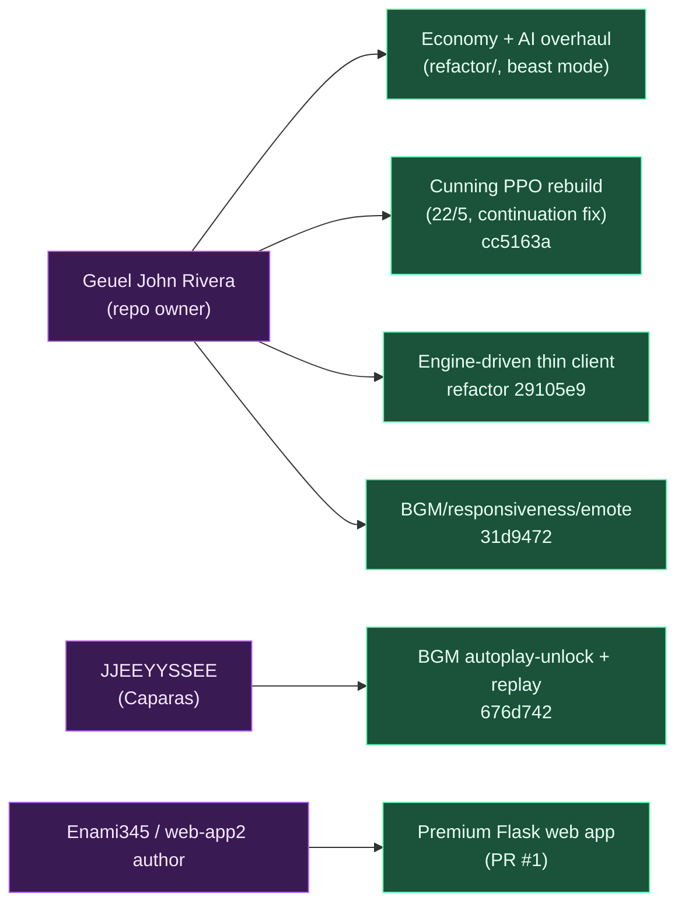

# Snakes & Lenders — Knowledge Graph

Visual index of how branches, commits, code modules, game features, training
pipeline, and docs connect. Built from this branch's commit history,
`knowledge/*`, and current source. Renders as Mermaid on GitHub.

---

## 1. Branch & commit lineage

How `refactor/economy-ai-overhaul` arrived at its current tip (`5364af0`).

**Color key:** blue = `main`, purple = `refactor/economy-ai-overhaul`,
green = `web-app`, orange = `feat/cunning-ppo-rebuild` (disposable).

---

## 2. Code module graph (Python + JS)

Solid arrow = Python import. Dashed arrow = HTTP call.

---

## 3. Feature → implementation map

Each gameplay/AI feature and the code that realizes it.

---

## 4. Training & inference pipeline

Two-stage training recipe → shipped model → in-game decisions.

---

## 5. Documentation topic map

Where to look for what. Doc → topic coverage.

---

## 6. People → contributions

---

## How to update this graph

When you ship a change that adds a new feature, file, or branch:

1. Add the node to whichever section it belongs in (feature → §3, code →
   §2, training change → §4, doc → §5, branch/commit → §1, contributor → §6).
2. Wire it to its neighbors (don't add isolated nodes — the value of this
   doc is the edges).
3. Keep each subgraph ≤ ~20 nodes; if a section is bursting, split it.
4. Don't paste full code or paragraphs of prose here — the node labels
   should point at the source file or doc that has the details.
